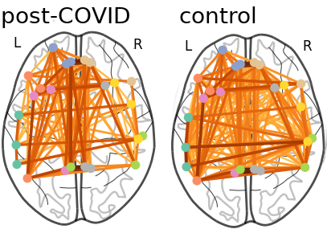
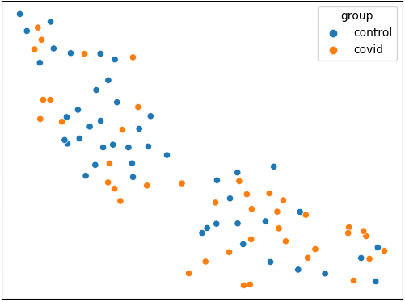

# Functional MRI networks of post-covid patients
## About
42 subjects (32 females, 10 males, mean age 56) have reported subjective complaints such as loss of focus and brain fogs following a COVID-19 infection. Clinical tests carried out have shown low scores in memory, attention, and executive control.

In this study, we analyse the functional connectivity of their attentional brain networks based on resting state fMRI sessions and compare them to a control group (46 pre-pandemic subjects with average scores on their clinical tests).

## Types of analysis
We make two types of analysis: one that compares the topology of functional networks *after* dividing in groups (group-based approach), and one that attempts to divide in groups just by looking at the functional networks (data-driven approach).

### Group-based approach

<picture>
  <source media="(prefers-color-scheme: dark)" srcset="modules/figures/comparison_example_light.png">
  
</picture>
<picture>
  <source media="(prefers-color-scheme: light)" srcset="modules/figures/comparison_example.png">
  
</picture>
<br><br><br>
1. The connectomes of each group are averaged. <br>
2. We compute typical network metrics (e.g. clustering coefficient, characteristic path length, small-worldness) and compare them. <br>
<br clear="left">

### Data-driven approach

<picture>
  
</picture>
<br>
1. We compute the pairwise distance of the subjects connectomes. This yields a <i>n x n</i> distance matrix. <br>
2. Clustering is performed on the distance matrix. <br>
3. We apply dimensionality reduction techniques and plot the resulting components. <br>
4. The relationship between the components and the clinical scores is studied, as well as how closely the clusters match the different groups. <br>
<br clear="left">

## Usage
To perform group-based analysis, the ```-g``` flag must be added to the command-line.