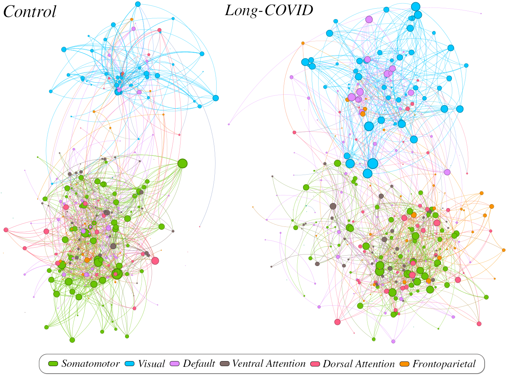

# Resting state fMRI networks of long-COVID patients
## About
42 subjects (32 females, 10 males, mean age 56) have reported subjective complaints such as loss of focus and brain fogs following a COVID-19 infection. Clinical tests carried out have shown low scores in memory, attention, language and executive control.

In this study, we analyse the functional connectivity of their functional brain networks based on resting state fMRI sessions. Topological measures (network efficiency, largest connected component and modularity) are computed on several thresholds (over the absolute correlation coefficients) and compared against a control group (43 pre-pandemic subjects with average scores on their clinical tests).

<div style="text-align: center;"></div>

## Usage
``nilearn`` is employed for data manipulation and ``networkx`` for graph analysis.

The following command will perform group-based analysis on the ```Default``` network using the ```schaefer``` atlas with 400 regions, applying a threshold at 5, 10, 15 and 20% of the maximum correlation coefficients:
```
python bold_analysis.py -n Default -a schaefer -nr 400 -tr 0.05 0.1 0.15 0.2
```

Any other of the seven brain networks in the ```schaefer``` atlas can also be extracted. Supported atlases for global analysis:
- ```schaefer```
- ```aal```
- ```destrieux```
- ```msdl```

Although outside the scope of the current study, the regions comprising a specific brain network in the ```aal``` atlas can also be defined in ```brain_networks.json```. Independent component analysis is also supported and can be run with the ```-nc``` flag, indicating the number of components to extract. 